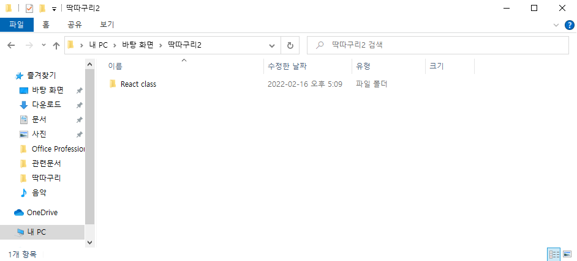
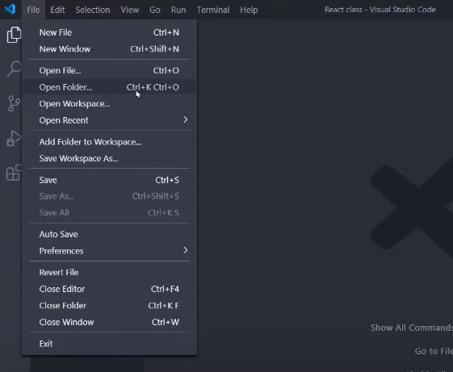

React 기초 1강 : 리액트 설치와 셋팅법
=======

---

## 1. Node.js 설치

- npm이라는 툴 이용가능 - 라이브러리를 쉽게 설치할 수 있음
- Create React App이라는 라이브러리를 사용하기 위해 설치

## 2. Visual Studio Code 설치

- App.js - 메인페이지에 들어갈 HTML 코딩 짜는 곳
- public의 index.html - Main 페이지
- node_modules - 라이브러리를 모아놓은 폴더
- public - static 파일 보관함
- src - 소스코드 보관함
- package.json - 설치한 라이브러리 목록

## 3. 폴더 생성

- React class 폴더 생성

## 4. 에디터에서 작업 폴더 Open Folder

- Visual Studio Code - File - Open Folder... 선택
- 생성했던 작업 폴더 선택

## 5. React 프로젝트 생성

- 터미널을 이용하여 명령어 입력
  - npx create-react-app blog
    - npx - 라이브러리 설치 도와주는 명렁어 (nodejs 설치 후 이용 가능)
    - create-react-app - react 세팅이 다 된 boilerplate 만들기 쉽게 도와주는 라이브러리
    - blog - 내가 만들 프로젝트의 명

## 6. 미리보기 띄우는 법

- 터미널을 이용하여 명령어 입력
  - npm start
